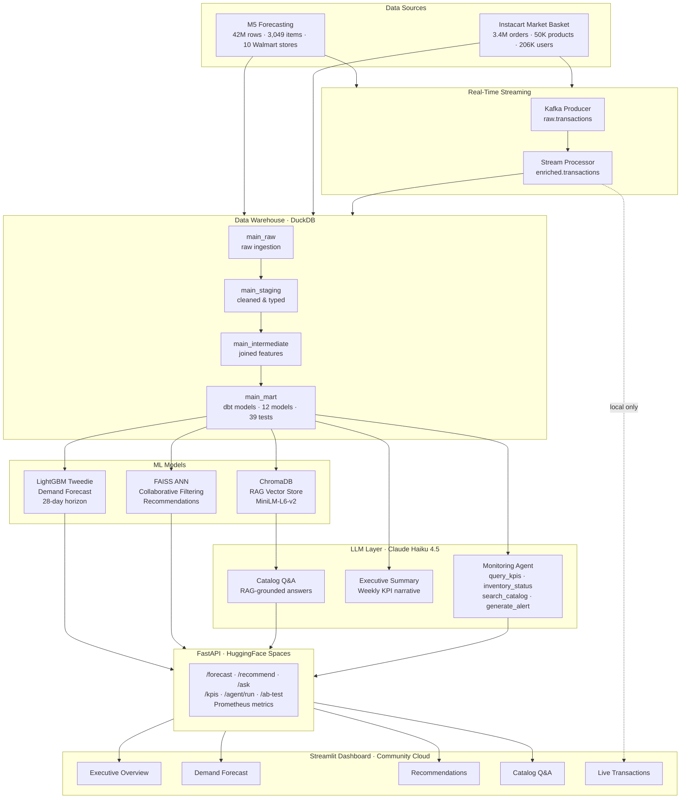

<div align="center">

# Retail Intelligence Platform

**An end-to-end ML + LLM system for retail analytics, demand forecasting, and real-time operations monitoring**

[](https://retail-intelligence-platform1359.streamlit.app)
[](https://koushik1359-retail-intelligence-api.hf.space/docs)
[](https://python.org)
[](LICENSE)

</div>

---

## Live Demo

| Surface | URL |
|---|---|
| Streamlit Dashboard | https://retail-intelligence-platform1359.streamlit.app |
| FastAPI Backend | https://koushik1359-retail-intelligence-api.hf.space |
| Interactive API Docs | https://koushik1359-retail-intelligence-api.hf.space/docs |

---

## Overview

The Retail Intelligence Platform is a production-grade data science system that combines classical ML, deep learning, LLM-powered agents, and real-time streaming into a single unified platform. Built on 3M+ real retail transactions across two public datasets (M5 Forecasting + Instacart), it demonstrates the full lifecycle from raw data ingestion to a deployed, interactive application.

---

## Architecture



---

## Modules

| # | Module | Description |
|---|---|---|
| 1 | **Data Ingestion** | Loads M5 + Instacart raw CSVs into DuckDB schemas |
| 2 | **dbt Transformations** | 12 models, 39 tests, 4 sources — staging → intermediate → mart |
| 3 | **Demand Forecasting** | LightGBM Tweedie regression, 5-fold CV, 28-day horizon per store/item |
| 4 | **Recommendations** | Matrix factorization embeddings + FAISS ANN search with A/B test framework |
| 5 | **RAG Catalog Q&A** | ChromaDB vector store, MiniLM-L6-v2 embeddings, Claude Haiku answers |
| 6 | **LLM Agent** | Agentic monitoring loop with 5 tools — KPIs, forecasts, inventory, catalog, alerts |
| 7 | **Real-Time Streaming** | Kafka producer + consumer, enriched.transactions topic, live dashboard |
| 8 | **FastAPI + Dashboard** | REST API with Prometheus metrics, 5-page Streamlit UI |

---

## Tech Stack

| Layer | Technology |
|---|---|
| Warehouse | DuckDB 0.10 |
| Transformations | dbt-core 1.8, dbt-duckdb |
| Data Quality | Great Expectations 1.18 (fluent API) |
| Forecasting | LightGBM 4, scikit-learn, pandas |
| Recommendations | FAISS-cpu, NumPy, sentence-transformers |
| Vector Store | ChromaDB 0.5 |
| LLM | Anthropic Claude Haiku 4.5 |
| Streaming | Apache Kafka / Redpanda, kafka-python |
| API | FastAPI 0.111, Uvicorn, Prometheus |
| Dashboard | Streamlit, Plotly |
| Orchestration | Apache Airflow |
| Experiment Tracking | MLflow |
| Deployment | HuggingFace Spaces (Docker), Streamlit Community Cloud |
| Artifact Storage | HuggingFace Datasets (XET storage) |

---

## Datasets

| Dataset | Description | Source |
|---|---|---|
| M5 Forecasting | Walmart daily sales — 42M rows, 3,049 items, 10 stores across CA, TX, WI | [Kaggle](https://www.kaggle.com/competitions/m5-forecasting-accuracy) |
| Instacart Market Basket | 3.4M orders, 50K products, 206K users | [Kaggle](https://www.kaggle.com/datasets/psparks/instacart-market-basket-analysis) |

---

## API Endpoints

| Method | Endpoint | Description |
|---|---|---|
| GET | `/health` | Liveness check |
| GET | `/forecast?store_id&item_id&horizon` | 28-day demand forecast |
| GET | `/recommend?user_id&n` | Personalised product list (A/B tested) |
| POST | `/ask` | RAG catalog Q&A via Claude |
| GET | `/kpis?days=7` | Executive KPI time series |
| GET | `/agent/run` | Trigger agentic monitoring loop |
| GET | `/agent/reports` | Past agent reports |
| GET | `/ab-test/results` | A/B test impression and conversion stats |
| GET | `/metrics` | Prometheus metrics |

---

## Project Structure

```
retail-intelligence-platform/
├── api/                          # FastAPI application
│   ├── main.py
│   └── schemas.py
├── dashboard/                    # Streamlit dashboard
│   ├── app.py
│   ├── style.py
│   └── pages/
│       ├── 1_Executive_overview.py
│       ├── 2_Demand_Forecast.py
│       ├── 3_Recommendations.py
│       ├── 4_Catalog_QA.py
│       └── 5_Real_Time_Transactions.py
├── data/
│   ├── create_deploy_db.py       # creates slim 2.5 MB deployment DB
│   └── chromadb/                 # vector store index
├── features/                     # dbt project
│   ├── models/                   # 12 models across 4 layers
│   └── profiles.yml
├── models/
│   ├── forecasting/              # LightGBM training + inference
│   ├── recommendations/          # FAISS + embedding pipeline
│   └── llm/
│       ├── agent.py              # agentic monitoring loop
│       └── executive_summary.py
├── pipelines/
│   ├── kafka/                    # producer + stream processor
│   └── rag_pipeline.py           # ChromaDB ingestion
├── tests/
│   └── test_data_quality.py      # Great Expectations checkpoint
├── dags/                         # Airflow DAGs
├── .env.example
└── README.md
```

---

## Local Setup

### Prerequisites

- Python 3.12
- Docker (for Redpanda / Kafka streaming)
- 8 GB RAM minimum (full DuckDB warehouse is ~2.6 GB)

### 1. Clone and install

```bash
git clone https://github.com/koushik1359/retail-intelligence-platform.git
cd retail-intelligence-platform
python -m venv .venv
source .venv/bin/activate        # Windows: .venv\Scripts\activate
pip install -r requirements.txt
```

### 2. Environment variables

```bash
cp .env.example .env
# Open .env and add your ANTHROPIC_API_KEY
```

### 3. Download datasets

Download M5 and Instacart CSVs from Kaggle and place them under `data/raw/`.

### 4. Build the warehouse

```bash
python pipelines/ingestion.py
cd features && dbt run && dbt test
```

### 5. Train models

```bash
python models/forecasting/train.py
python models/recommendations/train.py
python pipelines/rag_pipeline.py
```

### 6. Run locally

```bash
# API
uvicorn api.main:app --reload

# Dashboard (separate terminal)
streamlit run dashboard/app.py

# Kafka streaming (optional — requires Docker)
docker compose up -d
python pipelines/kafka/producer.py
python pipelines/kafka/stream_processor.py
```

### 7. Run data quality checks

```bash
pytest tests/test_data_quality.py -v
```

---

## LLM Agent

The monitoring agent runs an autonomous agentic loop — querying KPIs, checking inventory risk, searching the product catalog, and posting alerts — before writing a structured operations report to DuckDB.

```bash
# Run directly
python models/llm/agent.py

# Or trigger via API
GET https://koushik1359-retail-intelligence-api.hf.space/agent/run
```

---

## License

MIT — free to use, adapt, and build on.

---

<div align="center">
Built by <a href="https://github.com/koushik1359">Koushik Sreevatsa</a>
</div>
